# Investment AI 项目架构分析

## 项目概述

Investment AI 是一个基于 Go 语言开发的智能投资分析系统，集成了爬虫技术、AI 代理和数据分析功能。系统主要用于分析美股和A股市场，通过爬取财联社、雅虎财经等数据源，结合多个AI模型进行智能分析，并生成投资研报。

## 系统架构概览

项目采用 DDD（领域驱动设计）架构模式，基于 Freedom 框架构建，具有清晰的分层结构：

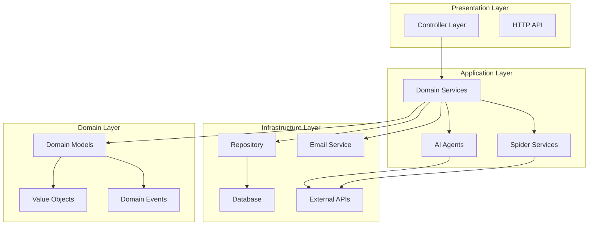

## 核心模块分析

### 1. 适配器层 (Adapter)

适配器层负责与外部系统的交互，包含以下子模块：

#### 1.1 AI 模块 (`adapter/ai`)

**AI 代理系统架构：**

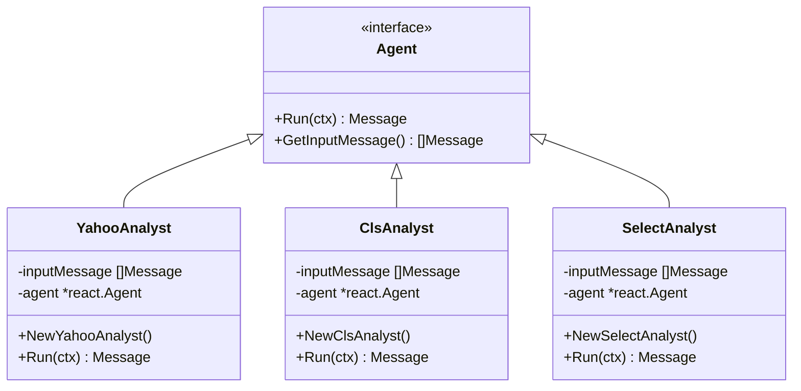

**AI 工具系统：**

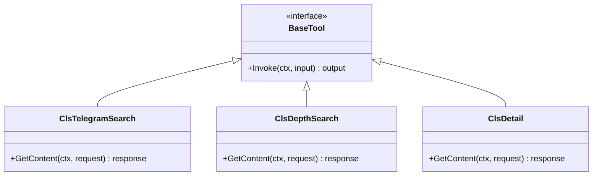

#### 1.2 爬虫模块 (`adapter/spider`)

爬虫系统负责从各种数据源获取金融信息：

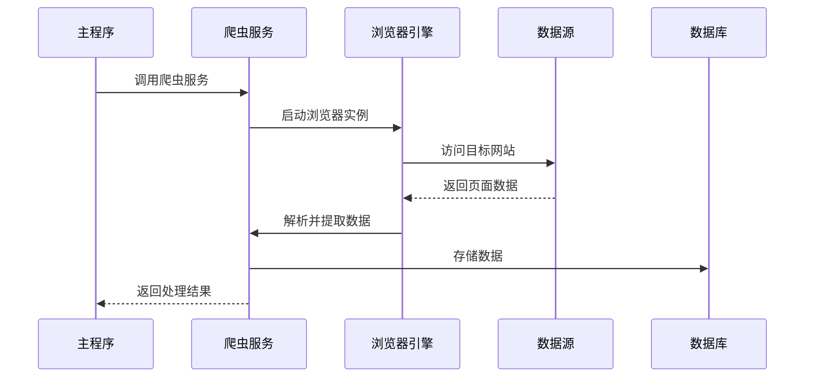

**主要爬虫功能：**
- 财联社新闻爬取 (`GetClsNews`)
- 财联社深度文章 (`GetClsDepthList`, `GetClsDepthDetail`)
- 财联社指数数据 (`GetClsQuotation`)
- 雅虎财经新闻 (`GetYahooNews`)

#### 1.3 控制器模块 (`adapter/controller`)

提供 RESTful API 接口，处理 HTTP 请求：

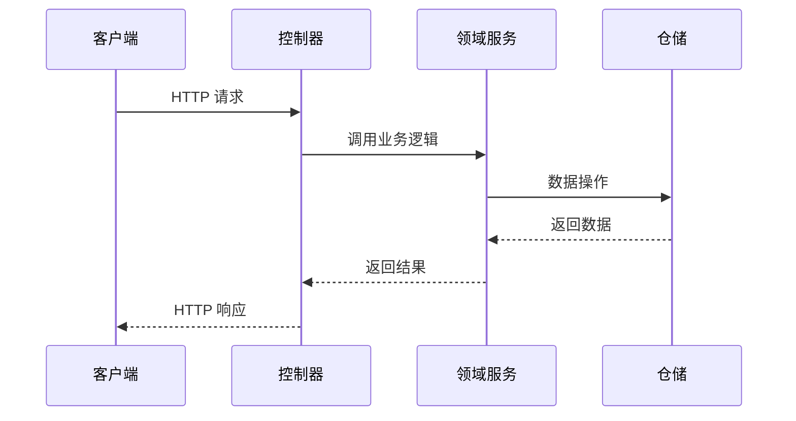

#### 1.4 仓储模块 (`adapter/repository`)

数据访问层，封装数据库操作：

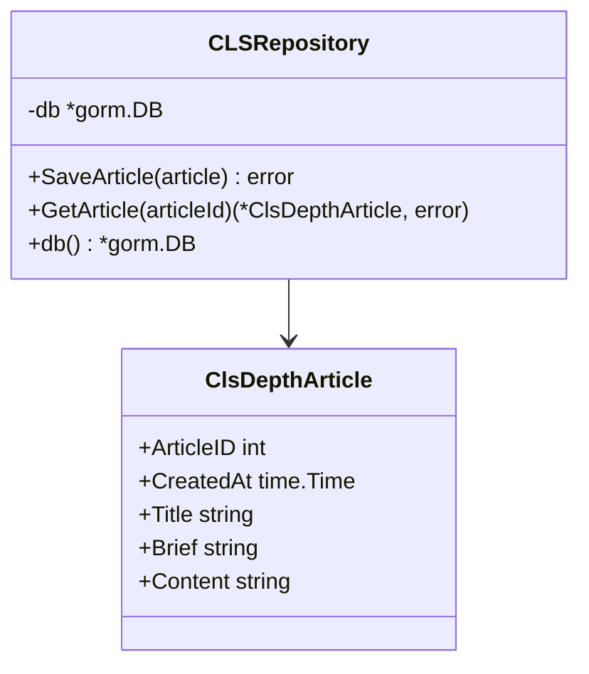

### 2. 领域层 (Domain)

#### 2.1 持久化对象 (`domain/po`)

定义数据库实体模型：

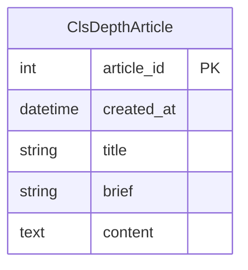

#### 2.2 值对象 (`domain/vo`)

定义数据传输对象和业务值对象：

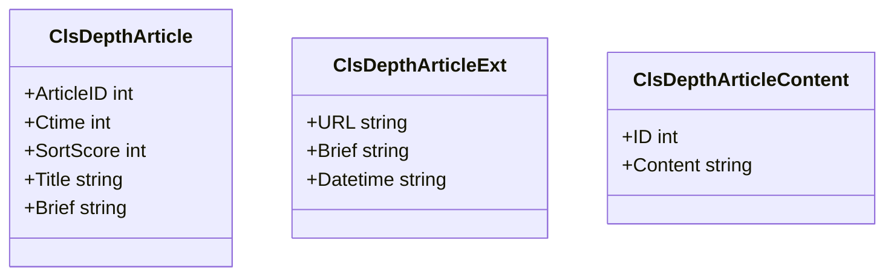

### 3. 基础设施层 (Infrastructure)

#### 3.1 请求处理 (`infra/request.go`)

统一处理 HTTP 请求的解析和验证：

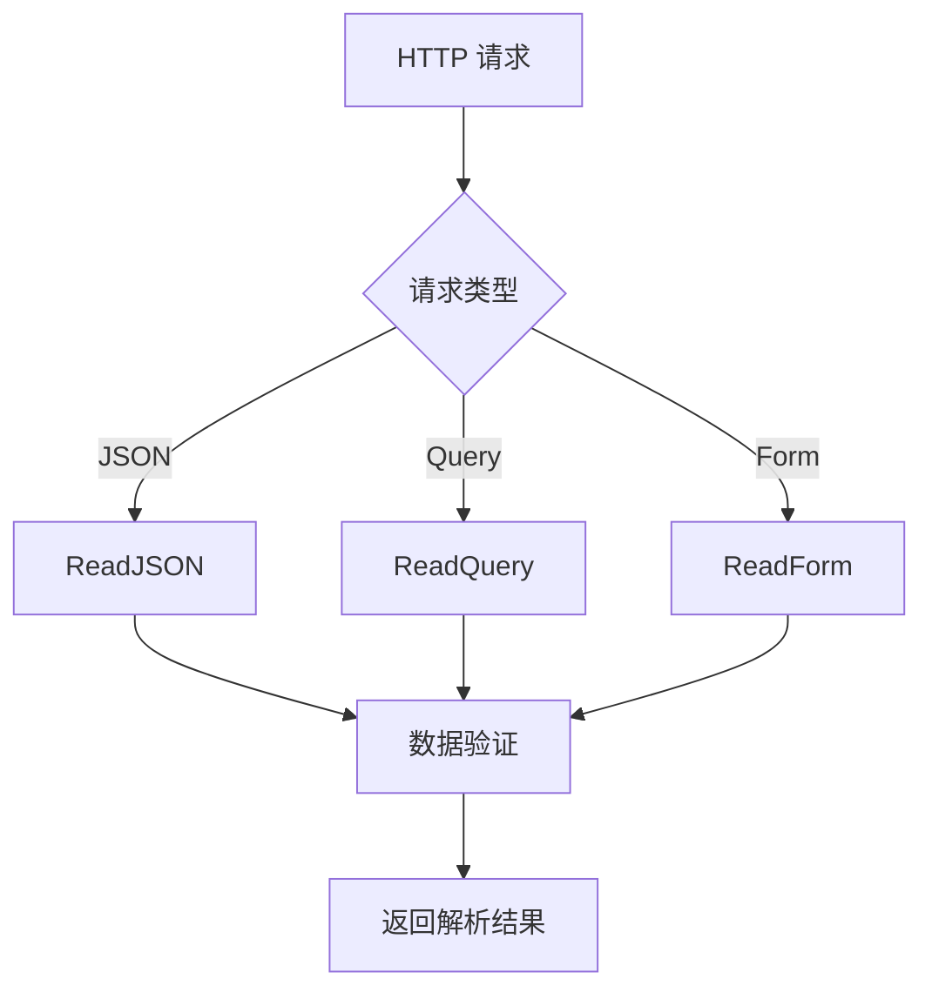

#### 3.2 响应处理 (`infra/response.go`)

统一的 JSON 响应格式：

```json
{
  "code": 200,
  "error": "",
  "data": {}
}
```

### 4. 工具层 (Utility)

#### 4.1 AI 模型配置 (`utility/models.go`)

支持多种 AI 模型提供商：

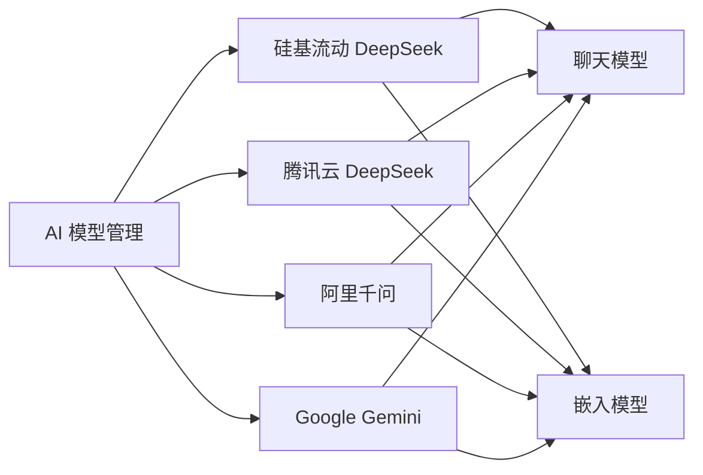

#### 4.2 爬虫工具 (`utility/crwl.go`)

基于 Conda 环境的爬虫执行器：

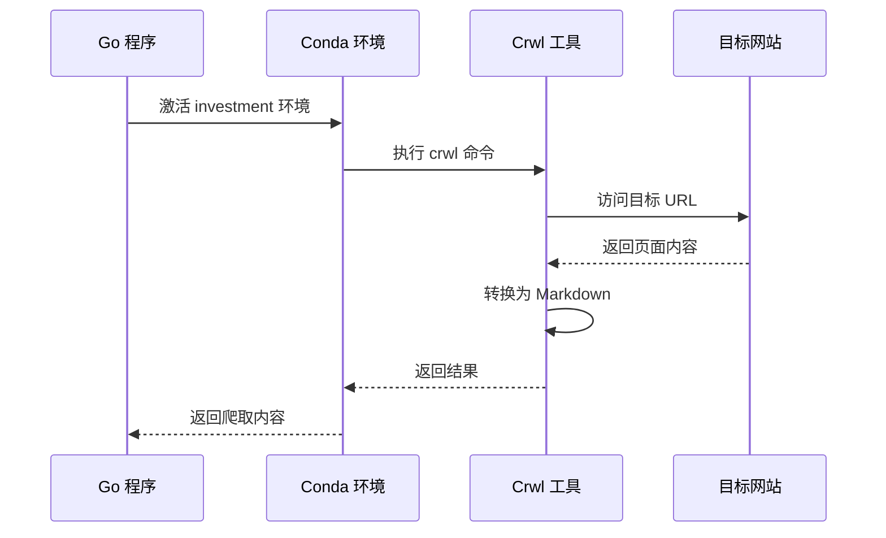

#### 4.3 邮件服务 (`utility/email.go`)

支持 HTML 格式的邮件发送功能。

### 5. 服务器配置 (Server)

#### 5.1 配置管理 (`server/conf/config.go`)

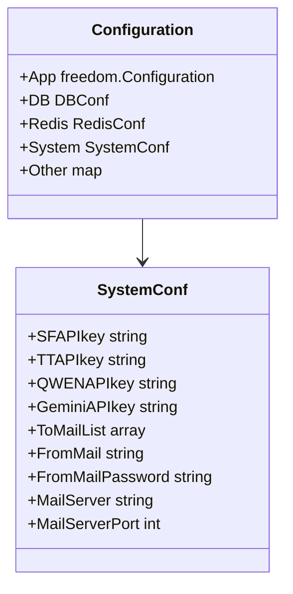

## 系统工作流程

### 美股分析流程

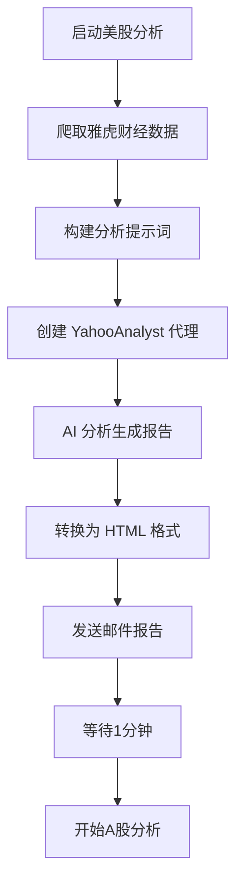

### A股分析流程

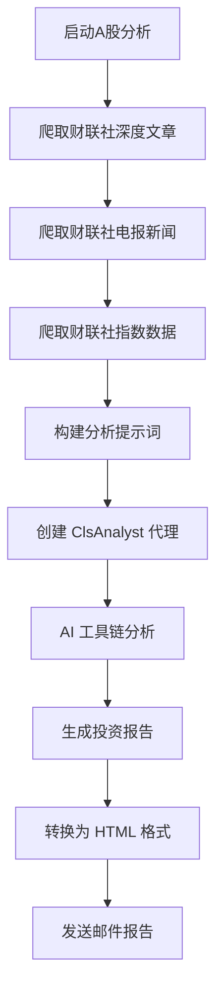

### AI 代理工作流程

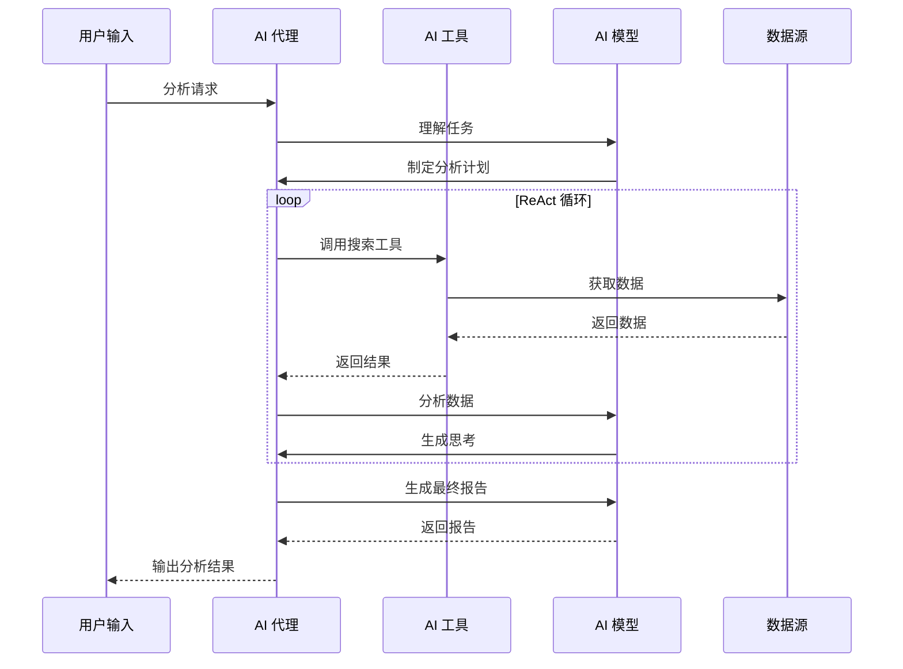

## 技术栈

### 后端技术
- **框架**: Freedom (基于 Iris 的 DDD 框架)
- **语言**: Go 1.21+
- **数据库**: MySQL (通过 GORM)
- **缓存**: Redis
- **AI 框架**: Eino (字节跳动开源)
- **爬虫**: Rod + Python Crwl

### AI 模型
- **DeepSeek R1**: 主要分析模型
- **千问 Plus**: 财联社分析
- **Gemini 2.0**: 备用模型
- **文本嵌入**: 多种嵌入模型支持

### 外部服务
- **数据源**: 财联社、雅虎财经
- **邮件**: SMTP 邮件服务
- **AI API**: 多厂商 API 支持

## 部署架构

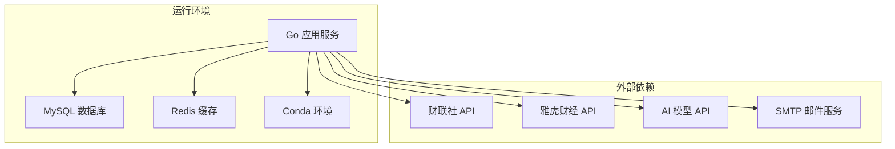

## 配置文件结构

```toml
[db]
addr = "数据库连接地址"
max_open_conns = 100
max_idle_conns = 10

[redis]
addr = "Redis连接地址"
password = "密码"
db = 0

[system]
sf_api_key = "硅基流动API密钥"
tt_api_key = "腾讯云API密钥"
qwen_api_key = "千问API密钥"
gemini_api_key = "Gemini API密钥"
to_mail_list = ["接收邮箱列表"]
from_mail = "发送邮箱"
from_mail_password = "邮箱密码"
mail_server = "SMTP服务器"
mail_server_port = 587
```

## 项目特点

### 优势
1. **模块化设计**: 清晰的 DDD 分层架构
2. **多模型支持**: 集成多个 AI 模型提供商
3. **智能分析**: ReAct 模式的 AI 代理
4. **数据丰富**: 多数据源整合
5. **自动化**: 定时分析和邮件推送

### 技术亮点
1. **AI 工具链**: 自定义 AI 工具系统
2. **爬虫集成**: Go + Python 混合爬虫方案
3. **配置灵活**: 支持多环境配置
4. **错误处理**: 完善的错误处理机制
5. **日志系统**: 结构化日志记录

## 扩展建议

### 功能扩展
1. **实时监控**: 添加市场实时监控功能
2. **策略回测**: 集成投资策略回测系统
3. **风险评估**: 增强风险评估模型
4. **用户系统**: 添加多用户支持
5. **API 网关**: 提供标准化 API 接口

### 技术优化
1. **缓存策略**: 优化数据缓存机制
2. **并发处理**: 提升并发处理能力
3. **监控告警**: 添加系统监控和告警
4. **容器化**: Docker 容器化部署
5. **微服务**: 拆分为微服务架构

## 总结

Investment AI 项目是一个设计良好的智能投资分析系统，采用现代化的技术栈和架构模式。系统通过集成多种数据源和 AI 模型，实现了自动化的市场分析和报告生成。项目具有良好的可扩展性和维护性，为进一步的功能扩展奠定了坚实的基础。